# Pool-Detection

The aim of this project is to provide a POC (Proof Of Concept) to prove the feasibility of **detecting pools from satellite images**.

This task will be divided into two steps:

- Create an image classification model (Convnet) to distinguish between images with pools and images without *no_pools*.
- Then use this model to scan satellite images and find the position of potential pools on the image.

***

## Available Data

```tree
└───data
    ├───train
    │   ├───no_pools
    │   └───pools
    ├───validation
    │   ├───no_pools
    │   └───pools
    └───zones
```

To create the image classifier, we dispose of around 1500 images of each class (pools, no_pools). This data are divided into **train** and **validation** sets. The **train** and **validation** set contain respectively around 1400 and 100 images of each class. Each image has a dimension of 50 x 50.

Sample images:

*pools* : 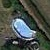 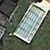 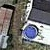 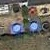 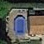 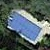 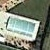 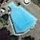 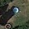 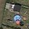 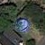 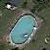

*no_pools* : 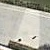 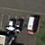 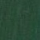 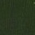 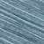 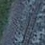 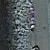 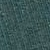 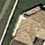  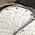 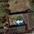

As for the satellite images on which the detection of *pools* will be performed, we have 30 of them in the **data/zones/** directory.


Sample satellite image *(zone18.jpg)*:

*zone18.jpg*

- Size of the training data :
    - *pools* : 1398 (50x50) images
    - *no_pools*: 1325 (50x50) images
- Size of the validation data:
    - *pools*: 179 (50x50) images
    - *no_pools*: 176 (50x50) images

***

## Installing the required python packages

```console
pip install -r requirements.txt
```

***

## Baseline Model

The baseline model is a simple 3-layered Convnet. This model is a simple implementation of a *Convolutional Neural Network* and will be used as reference (in terms of performance) to the rest of the tested models.

*PoolNetBaseline Architecture*

## Detection Mechanisms

For the detection part, we divide the image into a grid of 50x50 patches which give us 512 candidate positions to test per satellite image (see image below). The constraint that was imposed for this project is to process one image in less then 10 seconds, but with our baseline model (which is a very simple convnet) we are able to provide predictions for 30 satellite images in around 35 seconds on a CPU (with only two cores).

*Satellite image decomposition*

Another post-processing has been implemented to provide better predictions. Since we do not have any priors about the position of pools within the satellite image, we test for adjacency on the boxes that we've detected (horizontally or vertically) within the grid. This case is encountered when the pool image is divided between two patches, so we merge the boxes and recompute the probability for that specific patch (Exp: see image below.).

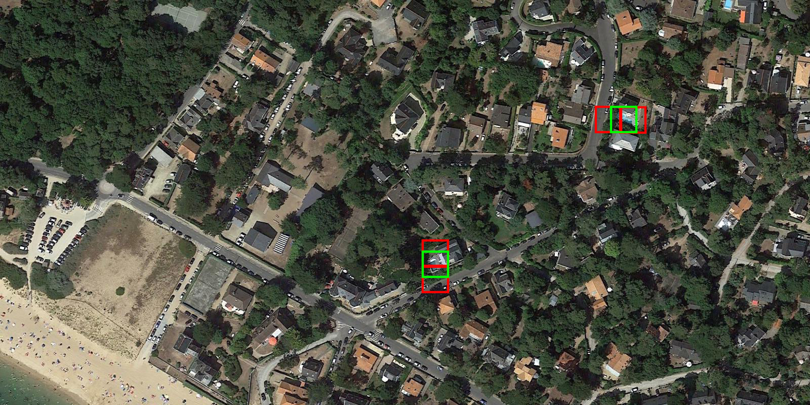*Merging adjacent bounding boxes for better location prediction*
***

## Results

### Quality of the classifier

*Train/Validation Loss/Accuracy*

### Quality of the detection

Sample Detection image *(zone18.jpg)*:

*Detection on a satellite image with a threshold of 0.5 (the default output of the **detect** class)*

*Detection on a satellite image with a threshold of 0.75 on the probability of each patch*

Along with the image we provide a dictionary that contains all information relative to the position and probabilities of each bounding boxes (In this context we only keep the patches with a probability > 0.5, as the purpose of this project is to prove the feasibility of such detection.).

Data relative to the detection image above *(zone18.jpg)*:

**"The reason we have only 6 bounding boxes in the detected image above is that we have a applied a filter that will only display patches with probability >= 0.75. This is done only for purpose of testing and visualization, by default the **detect** class will display all potential pool patches. (ie: probability >= 0.5)"**

```json
"./data/zones/zone18.jpg": {
        "pos": [
            [250,100],
            [1400,200],
            [1100,250],
            [900,500],
            [850,550],
            [1450,650],
            [975,50]
        ],
        "probas": [
            0.9920390248298645,
            0.7856220006942749,
            0.5162228345870972,
            0.9985809922218323,
            0.878549337387085,
            0.9921371936798096,
            0.9999746084213257
        ],
        "nbPools": 7
}
```

Each tuple in the *pos* list represents the (x,y) coordinates of the top left corner of the bounding box that represents a potential pool(to get the center of the bounding box, we just add 25 to x and y as we use a 50x50 sliding window for the detection.). For better detection, we try to improve the predicted position of the bounding boxes by merging two adjacent boxes as sometimes a *pool* could be in two sliding window. This approach helps to make better detections and get closer to the real number of pools in that snapshot.

### Heatmaps

The use of the heatmap is primarily to understand the behaviour of the implemented model and helps make the detection of potential targets easier. We use the probabilities we predicted in the previous task then scale the probability matrix to the size of the input image so we can overlay the resulting heatmap (generated from the probability matrix) onto the image. We use a ```fading_agent``` which is a matrix that creates the fading effect on the heatmap, this is used to indicate the center of the detection as the potential position of the pool.

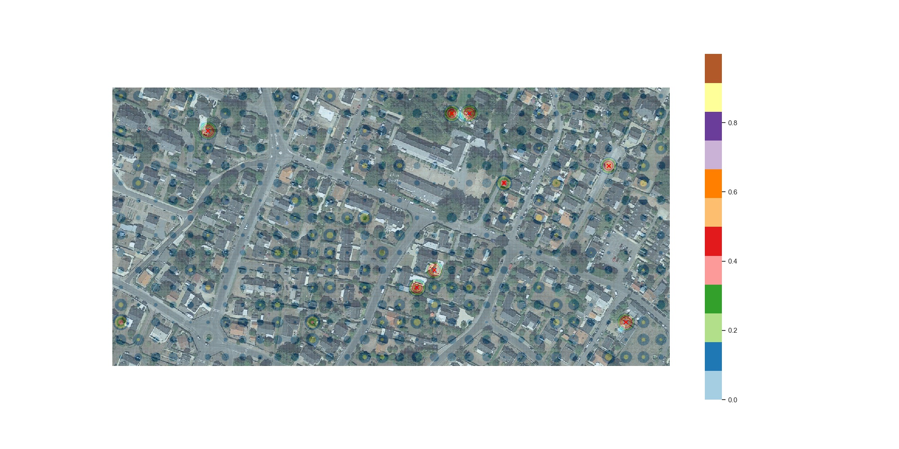*Example of a heatmap overlayed on satellite image*

***

## Going Further

This work is considered a Proof of Concept to prove the feasibility of the task and is intended to be a baseline work that can be later improved to create a better detection model.

In this section, I will propose three other approaches that require more data and more preparation:

1. Mine for more data from satellite image APIs or online maps to create more robust data and create an extensive database that includes the position of pools on each image. Then use this data to train an Object Detection model. (exp: ```Fast R-CNN```)

2. Use existing state of the art model for image classification like: ```Resnet```. But from the tests that I conducted during the preparation of this project, these model perform poorly (compared to simple ```Convnets```) on **low resolution** images. For this purpose, the use of a ```SRGAN (Super Resolution GAN)```[[1]](https://github.com/deepak112/Keras-SRGAN)  to upscale the training images to a size where we can use the aforementioned models without the degradation of performance can be a useful step better results. (A. Upscale the train images B. Train the model (transfer learning) on these images C. Scale the satellite images or use images with higher resolution D. Detect! = *same workflow*)

3. There are plenty of research that have been done on low resolution image recognition that can be implemented for this case as we are dealing with very low resolution images (50 x 50). Since these models are optimized to handle this type of input, we can *expect* better results compared to simple ```Convnet```.

### Credits
- [[1] Keras SR-GAN: Enhancing low resolution images by applying deep networks with adversarial networks (Generative Adversarial Networks) 
to produce high resolutions images.](https://github.com/deepak112/Keras-SRGAN)
- [Blog Keras for the necessary documentation on Keras](https://blog.keras.io/)