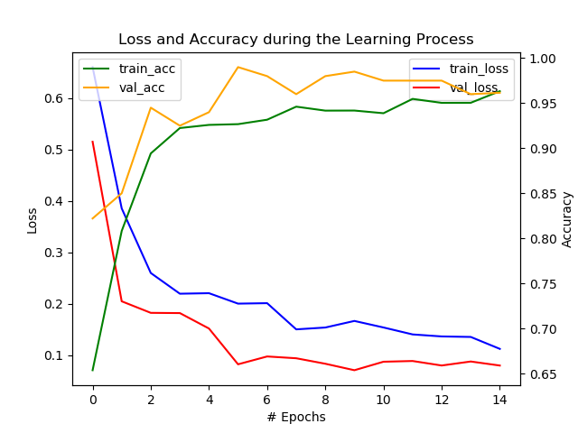
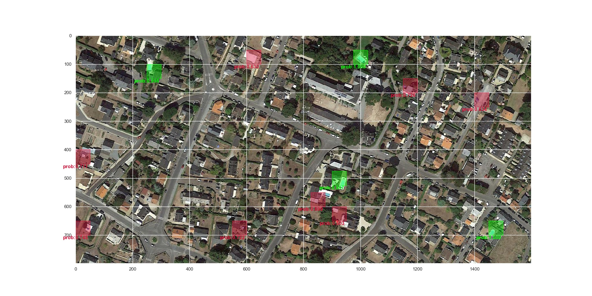

# Pool-Detection

The objectif for this project is to provide a POC (Proof Of Concept) to prove the feasability of **detecting pools from satellite images**.

This task will be divided into two steps :

- Create a image classification model (Convnet) to distinguish between images with *pools* and images without *no_pools*.
- Then use this model to scan satellite images and find the position of potential pools on the image.

***

## Available Data

```tree
└───data
    ├───train
    │   ├───no_pools
    │   └───pools
    ├───validation
    │   ├───no_pools
    │   └───pools
    └───zones
```

To create the image classifier we dispose of around 1500 images of each class (*pools*, *no_pools*). This data is divided into **train** and **validation** sets.
The **train** and **test** set contains respectively  around 1400 and 100 images of each class.
Each image has a dimension of 50 x 50.

Sample images:

*pools* :            

*no_pools* :            

As for the satellite images on which the detection of *pools* will be performed we have 30 of them in the **data/zones/** directory.

Sample satellite image *(zone18.jpg)*:

*zone18.jpg*

***

## Installing the required python packages

```console
pip install -r requirements.txt
```

***

## Models

### Baseline Model

The baseline model is a simple 3-layered Convnet. This model is a simple implementation of a *Convolutional Neural Network* and will be used as refrence (in terms of performance) to the rest of the tested models.

### Detection Mechanisms

***

## Results

### Quality of the classifier

- #Train data = X
- #Validation data = Y 

*Train/Validation Loss/Accuracy*

### Quality of the detection

Sample Detection image *(zone18.jpg)*:

*Detection on a satellite image with a threshold of 0.5 (the default output of the **detect** class)*

*Detection on a satellite image with a threshold of 0.75 on the probability of each patch*

Along with the image we provide a dictonary that contains all information relative to the position and probabilities of each bounding boxes (in this context we only keep the patches with a probability > 0.5, as the purpose of this project is to prove the feasability of such detection).

Data relative to the dection image above *(zone18.jpg)*:

**"The reason we have only 6 bounding boxes in the detected image above is that we have a applied a filter that will only display patches with probability >= 0.75. This is done only for purpose of testing and visualization, by default the **detect** class will display all potential pool patches (ie: probability >= 0.5)"**

```json
"./data/zones/zone18.jpg": {
        "pos": [
            [600,50],
            [250,100],
            [1150,150],
            [1400,200],
            [0,400],
            [900,600],
            [0,650],
            [550,650],
            [1450,650],
            [975,50],
            [900,475],
            [825,550]
        ],
        "probas": [
            0.6301023960113525,
            0.9981842041015625,
            0.7263420820236206,
            0.6344030499458313,
            0.7107011079788208,
            0.5031660795211792,
            0.7446680068969727,
            0.7219793200492859,
            0.9999578595161438,
            0.9997069239616394,
            0.9971867203712463,
            0.6991892457008362
        ],
        "nbPools": 12
    }
```

Each tuple in the *pos* list represents the (x,y) coordinates of the top left corner of the bounding box that represents a potential pool (to get the center of the bounding box we just add 25 to x and y as we use a (50x50) sliding window for the detection). For better detection, we try to improve the predicted position of the bounding boxes by merging two adjacent boxes as sometimes a *pool* could be in two slinding window. This approach helps to make better detections and get closer to the real number of pools in that snapshot.

### Heatmaps